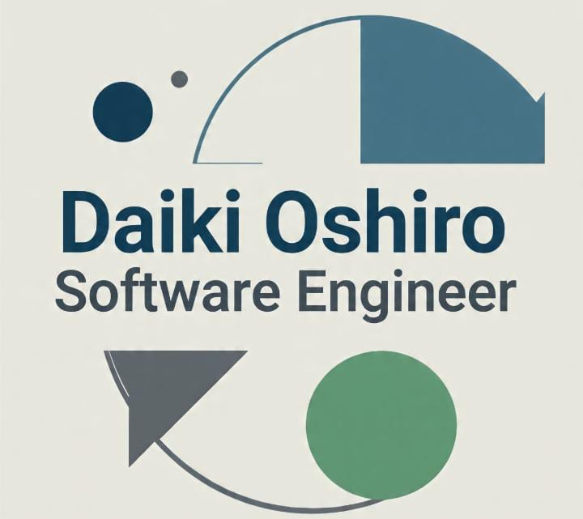
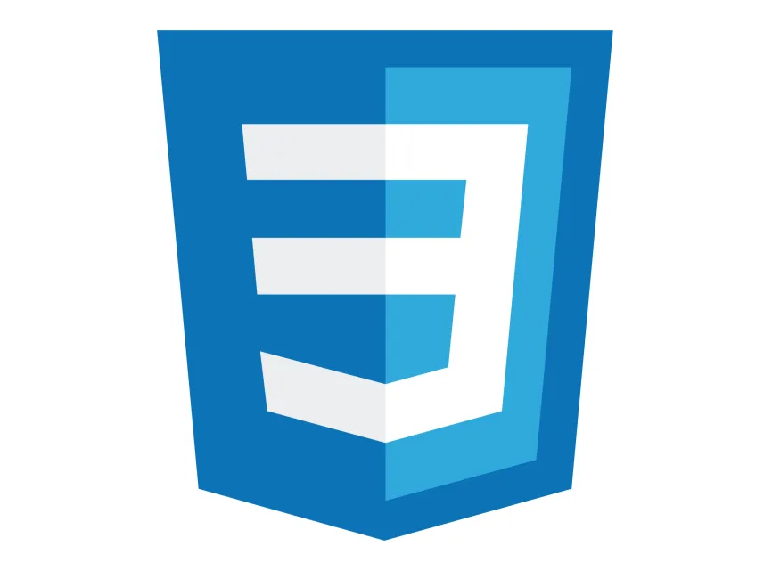
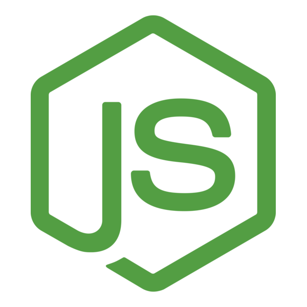
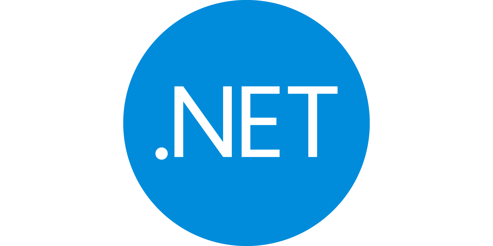
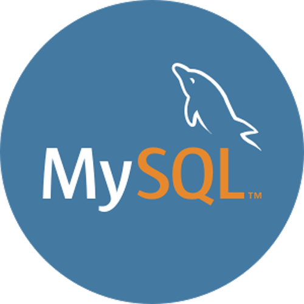

## 👨‍💻 About Me

  
  

  📚 <strong>Software Engineering Student</strong> 
  🏛️ Universidad Peruana de Ciencias Aplicadas (UPC) 
  🎓 <strong>7th semester</strong>

---

### ℹ️ Personal Information

🔵 <strong>Name:</strong> Daiki Oscar Oshiro Yamashita  
🟢 <strong>Age:</strong> 23 years old  
🟡 <strong>Location:</strong> Lima, Peru  
🟤 <strong>Languages:</strong> 🇪🇸 Spanish (Native) · 🇺🇸 English (Advanced)  
🔵 <strong>Interests:</strong> Web development  

### 🧠 Technologies & Knowledge

<h2 align="center">💻 Languages</h2>

  
  
  
  

<h2 align="center">🌐 Front-End Development</h2>

  
  
  
  
  

<h2 align="center">🛠️ Back-End Development</h2>

  
  
  

<h2 align="center">📱 Mobile Development</h2>

  
  

<h2 align="center">🧰 Softwares and Tools</h2>

  
  
  
  

### 🚀 Objective

Continue learning and growing as a developer by taking on new challenges that allow me to apply my skills to real and impactful projects. I am excited to be part of teams where I can both contribute and learn at the same time.

### 📫 Contact

If you'd like to collaborate or chat about technology, feel free to reach out!

<table>
  <tr>
    <th>Detail</th>
    <th>Information</th>
  </tr>
  <tr>
    <td>📧 Personal Email</td>
    <td>daikioshiro@gmail.com</td>
  </tr>
  <tr>
    <td>💻 GitHub</td>
    <td><a href="https://github.com/DaikiOY">github.com/DaikiOY</a></td>
  </tr>
  <tr>
    <td>📱 Phone</td>
    <td>+51 977 414 565</td>
  </tr>
</table>

